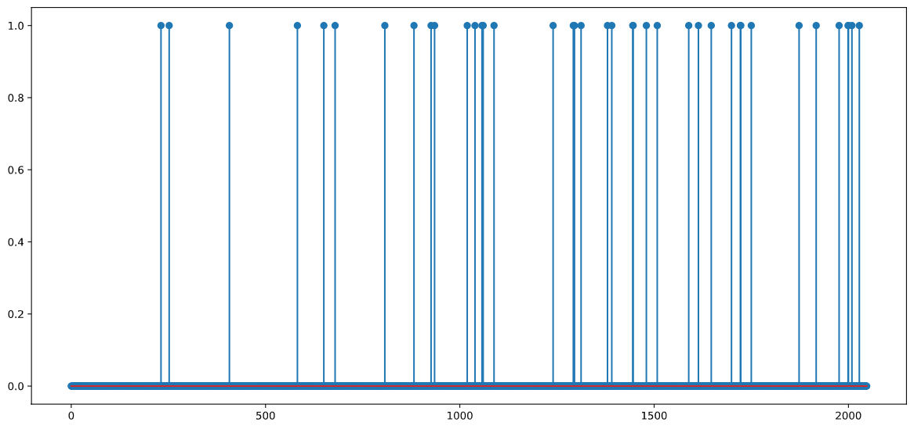
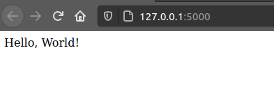
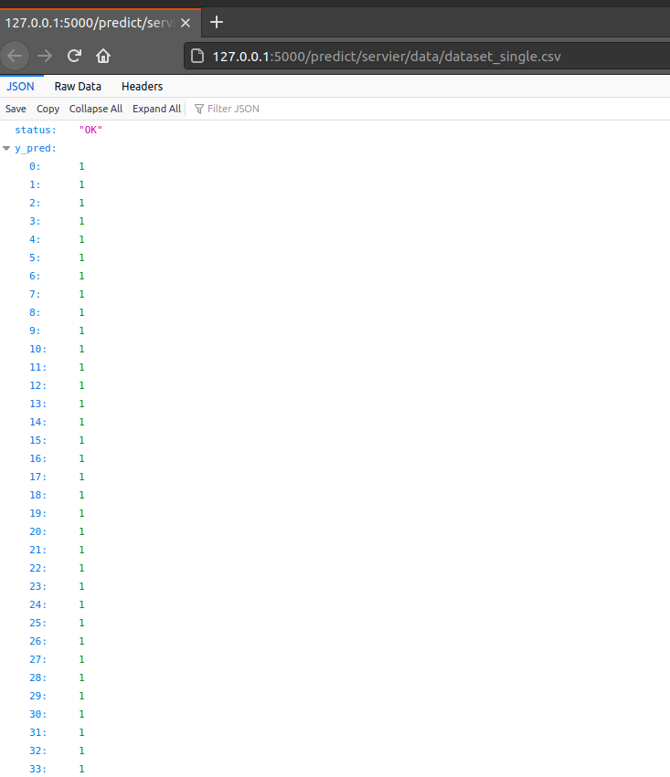
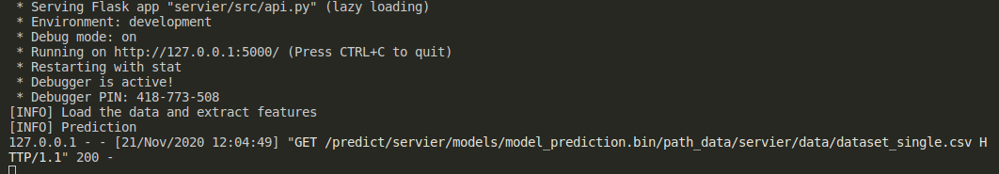

**Table of content**

- [Documentation](#documentation)
  - [What in this project ?](#what-in-this-project-)
- [Data Exploration](#data-exploration)
- [Machine Learning Model](#machine-learning-model)
- [Project Structure](#project-structure)
- [Setup the development environment](#setup-the-development-environment)
- [Running the App](#running-the-app)
- [Packaging the App](#packaging-the-app)
  - [Setup](#setup)
  - [Install the packaged App](#install-the-packaged-app)
  - [How to use it?](#how-to-use-it)
- [Dockerization](#dockerization)
  - [Setup](#setup-1)
  - [Build a docker image](#build-a-docker-image)
  - [Run the docker image](#run-the-docker-image)
- [Flask API](#flask-api)
  - [Setup](#setup-2)
  - [Simplify the execution with a script](#simplify-the-execution-with-a-script)
  - [Create a Prediction Endpoint](#create-a-prediction-endpoint)
- [Futur work](#futur-work)
- [Found an issue ? or You want to contribute?](#found-an-issue--or-you-want-to-contribute)

# Documentation

## What in this project ?

This project predict basic molecule's properties, from its fingerprint features, using machine learning

- Setup python environment using `miniconda`
- Parse argument from the CLI
- Load a dataset and perform feature extraction
- Split the dataset
- Train a classification machine learning model
- Save the pretrained model
- Predict the molecule properties using pretrained model
- Evaluate the model
- Package the app inside a docker image
- Access the `predict` method via a `Flask` API
- Documentation

# Data Exploration

`dataset_single.csv`

```python
    P1	mol_id	    smiles
0	1	CID2999678	Cc1cccc(N2CCN(C(=O)C34CC5CC(CC(C5)C3)C4)CC2)c1C
1	0	CID2999679	Cn1ccnc1SCC(=O)Nc1ccc(Oc2ccccc2)cc1
2	1	CID2999672	COc1cc2c(cc1NC(=O)CN1C(=O)NC3(CCc4ccccc43)C1=O...
3	0	CID5390002	O=C1/C(=C/NC2CCS(=O)(=O)C2)c2ccccc2C(=O)N1c1cc...
4	1	CID2999670	NC(=O)NC(Cc1ccccc1)C(=O)O
```

1. The target we want to predict is binary, 0 or 1. A classification model (such as RandomForest) is suitable for this problem
   
2. The target (`P1`) had 82.17% (4108) of 1's and 17.82% (891) of 0's

   ```
   1 - 82.17 % - 4108
   0 - 17.82 % - 891
   ```

3. A vector (of size `2048`) is obtained for each molecule after extracting its fingerprint features (using `fingerprint_features` method from `features_extration` module).
   Therefore, we concatenate this vector to the dataset for each molecule.
4. Load dataset and create features `X` and target `y` vectors for a dataset file using `pandas`

   ```python
   def LoadAndProcessData(path=config.path_single):

       print('[INFO] Load the data and extract features')
       isinstance(path, str)

       # load the csv file
       df = pd.read_csv(path)

       # extract features
       df['smiles_features'] = df.smiles.apply(
           lambda x: np.array(fe.fingerprint_features(x)))

       # merge the extracted features to the dataframe
       df_feat = pd.DataFrame()
       for i in range(len(df.smiles_features)):
           df_feat['fe_'+str(i)] = df.smiles_features[i]
       df_feat = df_feat.T.reset_index(drop=True)

       # [fe_0, fe_2, ... fe_2047]
       df_feat.columns = ['fe_'+str(i) for i in range(len(df.smiles_features[0]))]

       X_all = pd.concat([df, df_feat], axis=1)
       X_all.drop(columns=['mol_id', 'smiles_features', 'smiles'], inplace=True)

       y = X_all['P1']
       X = X_all.drop(columns=['P1'], axis=1)
       return X, y
   ```

# Machine Learning Model

- Split the data to train and validation
  ```python
  def SplitDataset(X, y):
  """
  Randomly Split the dataset into training and validation sets: 80%-20%
  """
  print('[INFO] Split the dataset: train - validation sets')
  X_train, X_valid, y_train, y_valid = train_test_split(
      X, y, test_size=.2, random_state=0)
  return X_train, X_valid, y_train, y_valid
  ```
- Classification model: Tree based such as Random Forest using `scikit-learn` package
  ```python
  model = RandomForestClassifier(
          n_estimators=config.n_est,
          max_depth=config.max_depth,
          n_jobs=-1,
          random_state=0)
  ```
  <!-- - Stratified Cross Validation -->
- Train the model
  ```
  model.fit(X_train, y_train)
  ```
- Perform prediction
  ```python
  model.predict(X_test)
  ```
- Evaluate the model by computing accuracy
  ```python
  accuracy = metrics.accuracy_score(y_true, y_pred)
  ```

# Project Structure

This project is organized as follow

```
.
├── Dockerfile
├── environment.yaml
├── README.md
├── run_flask_api.sh
├── app
│   ├── cli.py
│   ├── data
│   │   ├── dataset_multi.csv
│   │   ├── dataset_single.csv
│   │   └── dataset_single_folds.csv
│   ├── __init_.py
│   ├── media
│   │   ├── P1.png
│   │   ├── test_api.png
│   │   ├── test_flask.png
│   │   └── test_terminal.png
│   ├── models
│   │   ├── model_pred_multi.bin
│   │   └── model_pred_single.bin
│   └── src
│       ├── config.py
│       ├── feature_extractor.py
│       ├── flask_api.py
│       └── main.py
└── setup.py
```

# Setup the development environment

1. First download `miniconda` :

   ```shell
   wget --quiet https://repo.continuum.io/miniconda/Miniconda3-latest-Linux-x86_64.sh
   Miniconda3-latest-Linux-x86_64.sh -b -p ~/miniconda
   ```

   Export an environment variable for `miniconda`

   ```
   export PATH=~/miniconda/bin:$PATH
   ```

2. Create an isolated environment to develop the App

   Update conda packages

   ```
   conda update -n base conda
   ```

   Create and activate a virtual environment `app`

   ```
   conda create -y --name app python=3.6
   conda activate app
   ```

3. Install required packages

   ```
   conda env update -n app --file environment.yaml
   ```

   with `environment.yaml`

   ```yaml
   name: app
   channels:
     - conda-forge
     - anaconda
   dependencies:
     - rdkit
     - flask
     - gunicorn
     - pip
     - numpy
     - pandas
     - matplotlib
     - scikit-learn
     - click
   ```

4. Check if the environment is activated:

   If the setup is correctly done, the name of the environment `(app)` should appear at the beginning, like that:

   ```
   (app) amine@amine-HP-ZBook-15-G2:~/$
   ```

# Running the App

You can run the App from a terminal by executing the `main.py` file with `python3`

```shell
python3 app/src/main.py --help
```

output

```shell
usage: main.py [-h] [--data DATA]

optional arguments:
-h, --help   show this help message and exit
--data DATA  Specify the path of the dataset
```

Example:

```shell
python3 app/src/main.py --data app/data/dataset_single.csv
```

# Packaging the App

## Setup

To do that we need to create two files, `setup.py` and `cli.py`

1. `setup.py`: configure the application

   ```python
   from setuptools import setup

   setup(
       name="predmol",
       version="1.0.0",
       license='MIT',
       author='Amine Hadj-Youcef',
       author_email='amine.hadjyoucef@gmail.com',
       description='This application uses machine learning to predict basic properties of a molecule...',
       packages=["app"],
       entry_points='''
           [console_scripts]
           predmol = app.cli:main
           '''
   )
   ```

2. `cli.py` contains four commands: train, predict, evaluate

   ```python
    import sys
    import click
    from app.src.main import Train, Predict, Evaluate, LoadAndProcessData, SplitDataset


    @click.group()
    @click.version_option("1.0.0")
    def main():
        """Molecule's basic properties prediction App"""
        pass


    @main.command()
    @click.option('--data_path', '-d', type=str, required=True, default='app/data/dataset_single.csv', help="Please enter the path of data in order to train the model")
    def train(data_path):
        """Train a machine learning model for prediction and save the pretrained model to disk"""
        X, y = LoadAndProcessData(data_path)
        X_train, X_valid, y_train, y_valid = SplitDataset(X, y)
        click.echo(Train(X_train, y_train))


    @main.command()
    @click.option('--path_x_test', '-p', type=str, required=True, default='data/dataset_single.csv', help="Please enter the path of data in order to perform prediction")
    def predict(path_x_test):
        """Perform prediction using a pretrained Machine Learning prediction model"""
        click.echo(Predict(path_x_test))


    @main.command()
    @click.option('--y_pred', '-p', type=float, required=True, help='Enter the predicted array')
    @click.option('--y_true', '-t', type=float, required=True, help='Enter the true array')
    def evaluate(y_pred, y_true):
        """Evaluate the prediction model by measuring accuracy"""
        click.echo(Evaluate(y_pred, y_true))


    if __name__ == "__main__":
        main()
   ```

## Install the packaged App

Install the `predmol` package by entering in the terminal (from the root of the project)

```
pip install -e .
```

Check if the app is correctly installed

```
which predmol
/home/amine/miniconda/envs/app/bin/predmol
```

the application is correctly installed under the `app` environment.

## How to use it?

Issue the following command to know how to use the App

```
predmol --help
```

output:

```
Usage: predmol [OPTIONS] COMMAND [ARGS]...

Molecule's basic properties prediction App

Options:
--version Show the version and exit.
--help Show this message and exit.

Commands:
evaluate Evaluate model
predict Perform prediction using a pretrained Machine Learning...
train Train a machine learning model for prediction
```

For instance, in order to invoke the `train` command, you can do

```shell
premol train --help
```

```shell
Usage: predmol train [OPTIONS]

Train a machine learning model for prediction and save the pretrained
model to disk

Options:
-d, --data_path TEXT  Please enter the path of data in order to train the
                        model  [required]

--help                Show this message and exit.
```

so you need to mention the path to the dataset you want to train your model on

```
predmol train --data_path app/data/dataset_single.csv
```

Similarly, you can use `predict` and `evaluate` commands:

```
predmol predict --help
```

```
Usage: predmol predict [OPTIONS]

  Perform prediction using a pretrained Machine Learning prediction model

Options:
  -p, --path_x_test TEXT  Please enter the path of data in order to perform
                          prediction  [required]

  --help                  Show this message and exit.
```

and

```
predmol evaluate --help
```

```
Usage: predmol evaluate [OPTIONS]

  Evaluate the prediction model

Options:
  -p, --y_pred FLOAT  Enter the predicted array  [required]
  -t, --y_true FLOAT  Enter the true array  [required]
  --help              Show this message and exit.
```

**Note**:
These commands could be personalized depending on the way we want to interact with them.

# Dockerization

Another method for packaging the App and ensure scalability, we use `Docker` by creating a `Dockerfile`.

## Setup

For simplicity and stability we start from the base image of `miniconda3`, then we install required python packages and create a virtual conda environment.

`Dockerfile`

```docker
FROM  continuumio/miniconda3
LABEL Author, Amine HadjYoucef

ENV APP_HOME /app
WORKDIR $APP_HOME
COPY . $APP_HOME

#---------------- Prepare the envirennment
RUN conda update --name base conda &&\
    conda env create --file environment.yaml
SHELL ["conda", "run", "--name", "app", "/bin/bash", "-c"]

ENTRYPOINT ["conda", "run", "--name", "app", "python", "src/main.py"]
```

## Build a docker image

We build a docker image, named `app`, with the following commands

```
docker build --tag app .
```

**Note:**

1. The `Dockerfile` must be located in the root directory of the application (in this case)

2. Make sure [`Docker`](https://www.docker.com/products/docker-desktop) is installed on your machine (https://www.docker.com).

## Run the docker image

To run the App from the docker image we created (`app`)

```
docker run --rm -ti app
```

# Flask API

Another way to distribute and use the App is by packaging it as an API, for instance using the `Flask` API framework

## Setup

Install `Flask` inside conda virtual environment

```
conda install -n app -c anaconda flask
```

Create a python file for the api (`app/src/flask_api.py`) and configure `Flask`

```
export FLASK_APP=api
export FLASK_ENV=development
```

with `flask_api.py`

```python
from flask import Flask
from app.src.main import Predict, LoadAndProcessData

app = Flask(__name__)

@app.route('/')
def hello():
    return 'Hello, World!'

if __name__ == '__main__':
    app.run('0.0.0.0', 5000)
```

Run the API from the terminal

```
flask run
```

Open the browser on the port 5000 to check if the API is running:
http://127.0.0.1:5000/



## Simplify the execution with a script

For simplifying the setup I created a script (`run_flask_api.sh`) to gather `Flask` setup from one file.

`run_flask_api.sh` :

```shell
#!/bin/bash

export FLASK_APP=app/src/flask_api.py
export FLASK_ENV=development

flask run --port 5000
```

and it can be executed from the terminal

```
sh run_flask_api.sh
```

## Create a Prediction Endpoint

To create a prediction endpoint, we import the `Prediction` method from the main file (`app/src/main.py`) and create an endpoint for it in the flask API.

The endpoint takes two arguments parameters: the model path and the dataset path, `path_model`, `path_X_test`, respectively.

Source code:

```python
from flask import Flask
from app.src.main import Predict, LoadAndProcessData

app = Flask(__name__)

@app.route('/')
def hello():
    return 'Hello, World!'

@app.route('/predict/<path:path_X_test>')
def predict(path_X_test):
    """
    Example:
    path_X_test=app/data/dataset_single.csv
    Link:
        http://127.0.0.1:5000/predict/app/data/dataset_single.csv
    """
    isinstance(path_X_test, str)
    y_pred = Predict(path_X_test)
    return {'status': 'OK', 'y_pred': y_pred.tolist()}

if __name__ == '__main__':
    app.run('0.0.0.0', 5000)
```

Access the predict endpoint of the API with this URL: [http://127.0.0.1:5000/predict/app/data/dataset_single.csv
](http://127.0.0.1:5000/predict/app/data/dataset_single.csv)

If everything works fine, on the browser you should see something like that:


and on the terminal you should expect something like that:


# Futur work

- Tune hyperparameter of RandomForest model
- Implement Stratified Cross Validation
- Implement others Machine Learning model
- Improve the interaction with the app

# Found an issue ? or You want to contribute?

Please create an issue and thank you for your contribution
